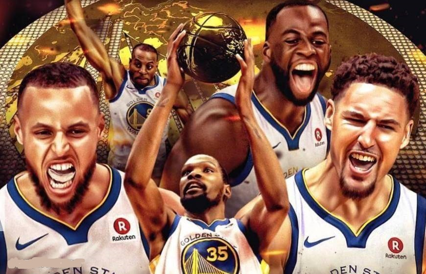
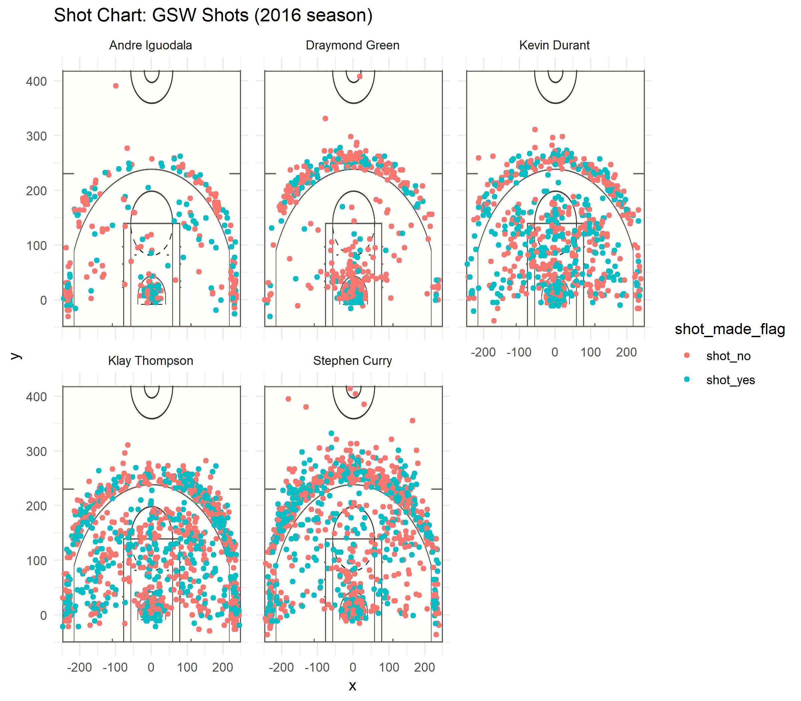
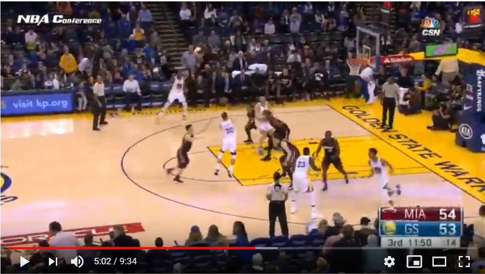
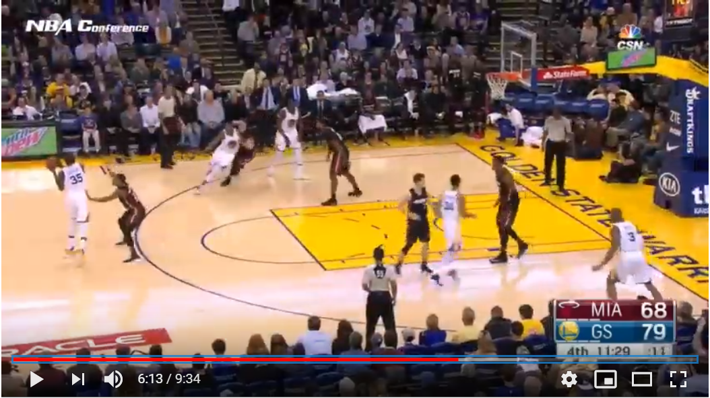
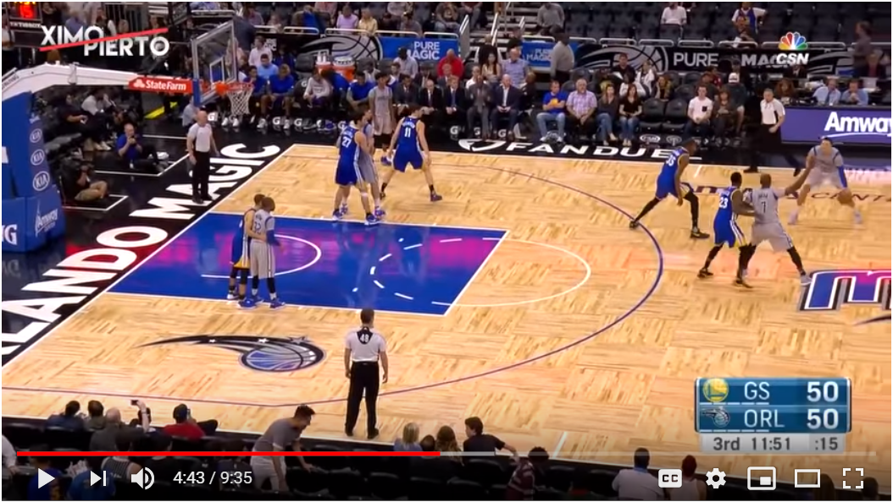
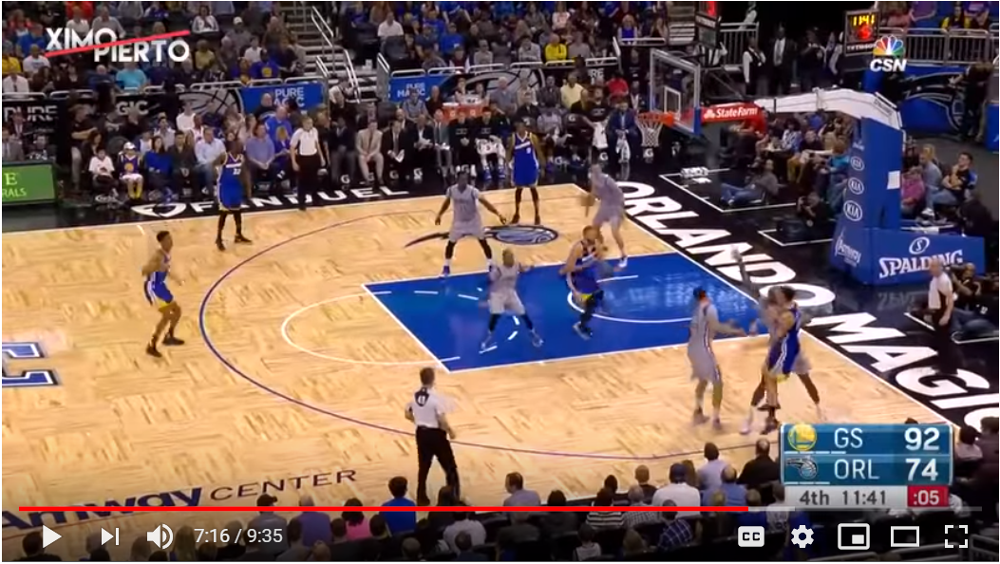

Workout1
================
Zimeng Zheng
March 10, 2019

Nightmare Warriors! Crazy 3rd Period!
=====================================

In 2016 summer, Golden State Warriors got one of the best player in NBA --- Kevin Durant. Since then, GSW had got five stars, which made GSW much more stronger than before. Here, we will use the data of shots from five stars to analyze the offence of Warriors and which period they performanced the best.

### 1.Team General Analysis

In 2016-2017, Golden State Warriors was the best scoring team, and most of the scores were from the five stars. Now, let's use the shooting data of the five stars to analyze the offensing style of GSW.

| Team    | 2PT\_perc | 3PT\_perc |
|---------|-----------|-----------|
| GSW     | 55.29%    | 39.49%    |
| Average | 50.3%     | 35.8%     |

Many people think that GSW was a team relying on 3-PT shooting. However, from the table, we can know that both 2-point percentage and 3-point percentage of the five stars were higher than the league average in 2016-2017. That means, actually GSW performanced well both on 2-point and 3-point, and they did not just rely on their 3-PT shootings.

### 2.Player Analysis

Five stars did well both on 2-point and 3-point, but not all of them were good at both. Everyone did their own job and made use of their potential, which was one of the reasons why GSW was so strong.

From this picture, we can directly get the players' shooting information. It is more intuitive using the image to get the shooting information instead of data. From the picture, we can find that the shooting percentage of Green seems the lowest, Curry and Thompson shot more outside the 3PT-line, Iguodala and Durant shot better inside the 3PT-line. We can see it more clearly using tables.

| name     | total | made | made\_perc |
|----------|-------|------|------------|
| Durant   | 915   | 495  | 54.10%     |
| Iguodala | 371   | 192  | 51.75%     |
| Thompson | 1220  | 575  | 47.13%     |
| Curry    | 1250  | 584  | 46.72%     |
| Green    | 578   | 245  | 42.39%     |

This is the table about the total shooting of the five stars. We can see that Durant had the highest effective shooting percentage and Green had the lowest. Someone may ask that with such low percentage, why Green was still in the starting lineup. That because Green was a great defener and data we have can't tell this fact.

Then, who was good at 3PT ball shooting and who was good at 2PT? Now, let's look at these two tables, then we can get the answer:

| name     | 2PT\_shot | 2PT\_made | 2PT\_perc |
|----------|-----------|-----------|-----------|
| Iguodala | 210       | 134       | 63.81%    |
| Durant   | 643       | 390       | 60.65%    |
| Curry    | 563       | 304       | 54.00%    |
| Thompson | 640       | 329       | 51.41%    |
| Green    | 346       | 171       | 49.42%    |

| name     | 3PT\_shot | 3PT\_made | 3PT\_perc |
|----------|-----------|-----------|-----------|
| Thompson | 580       | 246       | 42.41%    |
| Curry    | 687       | 280       | 40.76%    |
| Durant   | 272       | 105       | 38.60%    |
| Iguodala | 161       | 58        | 36.02%    |
| Green    | 232       | 74        | 31.90%    |

From these two tables, we prove our intuitive conclusion from the picture: Iguodala and Durant performanced better in 2PT balls. Curry and Thompson performanced better in 3PT balls. Iguodala had the least shooting opportunities but highest 2PT shooting percentage. The reason of this is that his shooting often came from cutting and changeover, which had a high success rate but needed the help from the teammates and opportunities.

From these tables, we cannot tell which player is the best player in Warriors, because everyone had their own forte and their own duty. They were a team and shared balls but not just played individually.

### 3. Period Analysis

People who often watched Warriors' games can find that Warriors did not often lead too much or even fell behind in the first half. However, they could score a lot in the third period. For example:

In the game vs Heats on January 10th, before the third period:

After:

In the game vs Magic on January 22nd, before the third period: 

After: 

So why is that? Now, let's try to explain it using the data we have.

#### 1). Which Period Warriors Performanced the Best?

| Period | total | made | made\_perc |
|--------|-------|------|------------|
| 1      | 1266  | 606  | 47.87%     |
| 2      | 1066  | 527  | 49.44%     |
| 3      | 1215  | 604  | 49.71%     |
| 4      | 787   | 354  | 44.98%     |

From this table, we can see that in the third period, five stars got the highest shooting percentage and nearly most made shots. That means Warriors did pretty well on offence in the third period. According to the fact taht Warriors usually scored a lot and made fundation on winning the game, that makes sense.

#### 2). Why Warriors Scored So Much in the 3rd Period?

| Period | 3PT\_shot | 3PT\_made | 3PT\_perc |
|--------|-----------|-----------|-----------|
| 1      | 562       | 222       | 39.50%    |
| 2      | 457       | 180       | 39.39%    |
| 3      | 584       | 255       | 43.66%    |
| 4      | 329       | 106       | 32.22%    |

We all know that 3-point ball is the most powerful way to score in basketball games. From the table above, we can find that Warriors' five stars shot the most 3-point, made the most 3-point and got the second highest 3-point percentage in the third period. That is one of the reasons why Warriors could seal the victory in the third period. They not only scored a lot, but also destroyed opponent's confidence in the third period using so many 3-point shots. One of the other reason is that they can also restricted opponent's scoring, but we cannot analyze the defence of the Warrior in the third period from the data we have, so we just ignore it in this passage.

#### 3). Who was the Craziest Player in the Third Period?

The next question we want to discuss is that who was the craziest player in the craziest period. Let's have a look at each player's performance in the third period:

| name     | 2PT\_shot | 2PT\_made | 2PT\_perc | 3PT\_shot | 3PT\_made | 3PT\_perc |
|----------|-----------|-----------|-----------|-----------|-----------|-----------|
| Curry    | 196       | 105       | 53.57%    | 232       | 112       | 48.28%    |
| Durant   | 156       | 94        | 60.26%    | 78        | 30        | 38.46%    |
| Thompson | 141       | 70        | 49.65%    | 173       | 81        | 46.82%    |
| Green    | 91        | 47        | 51.65%    | 63        | 19        | 30.16%    |
| Iguodala | 47        | 33        | 70.21%    | 38        | 13        | 34.21%    |

From this table, we can see that five stars' shooting percentages mostly increased in the third period both 2-PT and 3-PT. Everyone performanced pretty good in the third period. And we can notice that Stephen Curry had a extremely high 3PT-shooting percentage in the third period. In general, Curry's 3-PT percentage was 40.76%, but in the third period, he had a 3-PT prcentage at 48.28% which was the highest 3-PT percentage among the five stars! What's more, he shot most 3-PT balls among five stars in the third period. From this, I think he was the best player in the third period for his 3-PT shooting was so destructive. His 3-PT balls made contribution on going ahead the score or increasing the difference of the points. He devoted most to the Warriors' crazy third period and lays a fundation for the winning. Maybe his crazy 3-point shooting also encouraged his teammates to performance better in the third period.

### 4. Summary

In summary, we find that in season 2016-2017, Warrior was very strong, because they performanced both perfectly in 2-PT shooting and 3-Point shooting and every player had their own duty and they did very good job on what they were supposed to do. Beside, they performancd the best in the third period. They shot a lot of 3-PT balls and had a extremely high percentage in 3rd period which made them usually seal the victory just in the third period. Everyone performed very well, especially Curry. He was the best 3PT shooter in the third period. His good performance also encouraged his teammates in the third period.

This season, another great player Cousins joined in GSW, and till now, Warriors performanced very well. Hope that Warriors can get the champion this year and reproduce the miracale making three in a row.

**GO WARRIORS GO!!!**
